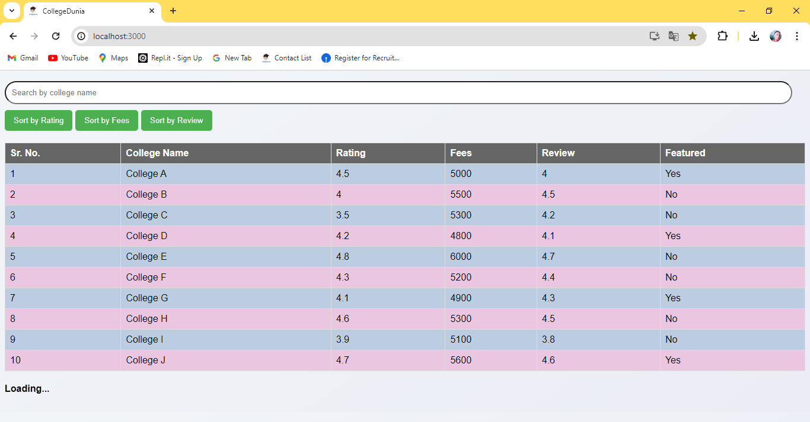
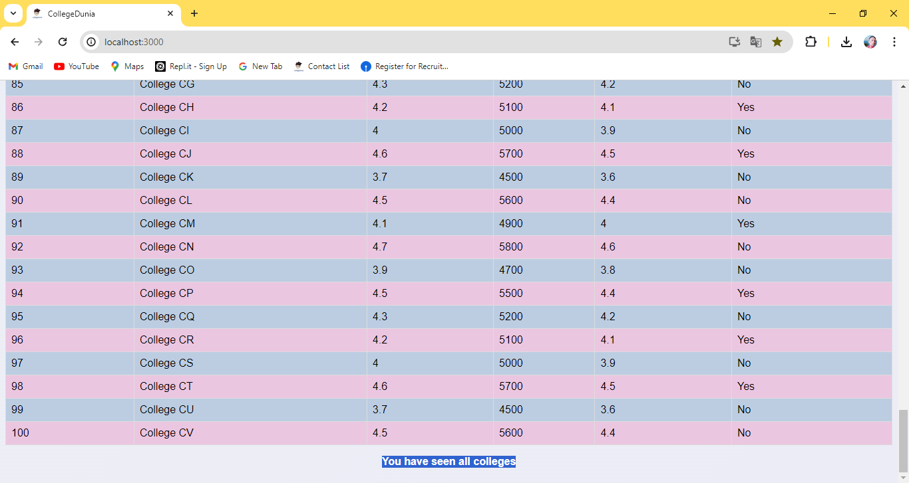
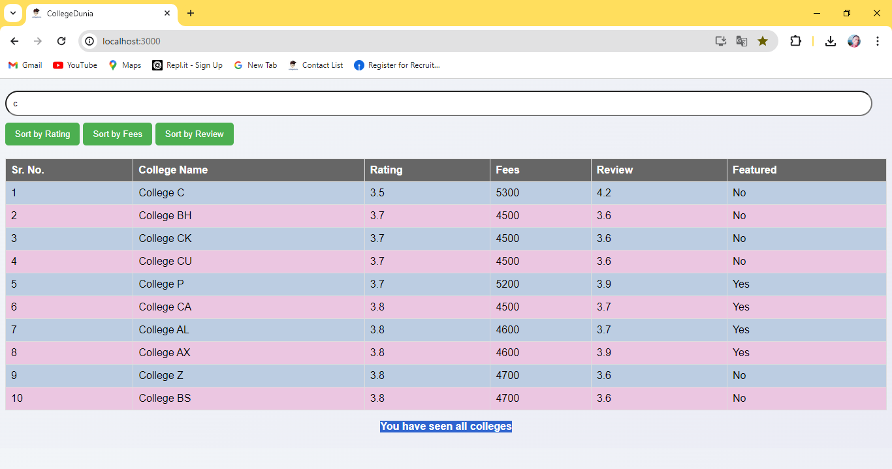
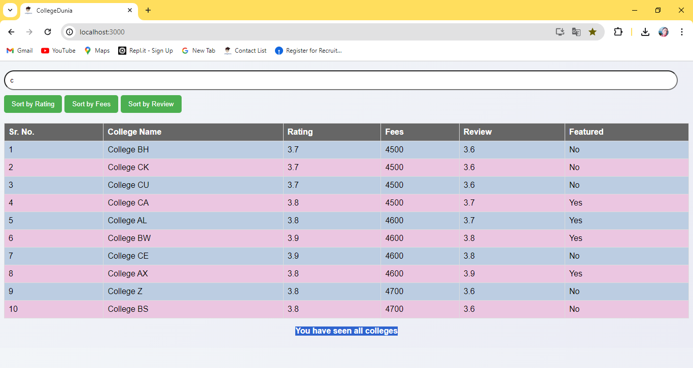

# Collegeduniya

## Overview
<p align="justify"> `CollegeTable` is a React component designed to display a list of colleges in a table format. It features infinite scrolling, dynamic sorting, and search capabilities. The component is ideal for managing and displaying large datasets, allowing users to interact with the data efficiently. </p>

### Click the Go Live button and see the live👉 [Go Live](https://collegeduniya-vishal.netlify.app)

## Installation
- Install the required dependencies using npm install.
- Start the server using npm start.

## Folder Structure
- #### public
- #### src
    - ###### Components
        - ###### CollegeTable
            - ###### CollegeTable.css
            - ###### ColegeTable.js
        - ##### data.json
    - ###### App.css
    - ###### App.js
    - ###### index.css
    - ###### index.js
- #### package.json
- #### README.md

## Features

- **Infinite Scrolling**: Loads more data as the user scrolls down, enhancing performance and user experience.
- **Sorting**: Allows users to sort the data by college rating, fees, and user review ratings both in ascending and descending order.
- **Search**: Includes a search function to filter colleges by name.
- **Featured Flag**: Highlights colleges that are marked as "featured" for easy identification.

## Prerequisites

Before you begin, ensure you have the following installed:
- Node.js and npm
- React.js (this component is built with React)

## Installation

To use the `CollegeTable` component in your project, follow these steps:

1. **Clone the Repository** (if applicable):
   ```bash
   git clone https://github.com/yourusername/your-repository.git
   cd your-repository
   ```

## Usage
<p align="justify">Upon integration, the CollegeTable component requires no additional props to function. It encapsulates all its logic internally, handling state management, data fetching, and UI rendering autonomously.</p>

- **Searching:** Simply type the name of a college in the search bar to filter the table.
- **Sorting:** Click on any sortable column header to toggle between ascending and descending sorting for that column.

## Customization
<p>You can customize the component to better fit your specific requirements or to integrate more closely with your application's styling and functionality:</p>

- **CSS Modifications:** Adjust the styles in `CollegeTable.css` to change the visual appearance of the table.
- **Functionality Extensions:** Modify `CollegeTable.js` to introduce new features like additional filtering options, links to detailed college pages, or integration with a backend API for live data fetching.

## Contributing
<p align="justify">Contributions to improve or enhance the `CollegeTable` component are highly welcomed. Please feel free to fork the repository, make your changes, and submit a pull request.</p>

### Output Screen
- Initially Before reached College name.
#### Initial Ten College Name
  

- After Searching college name
#### Searched College Name
   

- Sorting the College name By Rating
#### Sort By Rating
   

- Sorting the College name By Fees
#### Sort By Fees
   

- Sorting the College name By Review
#### Sort By Review
   


This project was bootstrapped with [Create React App](https://github.com/facebook/create-react-app).

## Available Scripts

In the project directory, you can run:

### `npm start`

Runs the app in the development mode.<br />
Open [http://localhost:3000](http://localhost:3000) to view it in the browser.

The page will reload if you make edits.<br />
You will also see any lint errors in the console.

### `npm test`

Launches the test runner in the interactive watch mode.<br />
See the section about [running tests](https://facebook.github.io/create-react-app/docs/running-tests) for more information.

### `npm run build`

Builds the app for production to the `build` folder.<br />
It correctly bundles React in production mode and optimizes the build for the best performance.

The build is minified and the filenames include the hashes.<br />
Your app is ready to be deployed!

See the section about [deployment](https://facebook.github.io/create-react-app/docs/deployment) for more information.

### `npm run eject`

**Note: this is a one-way operation. Once you `eject`, you can’t go back!**

If you aren’t satisfied with the build tool and configuration choices, you can `eject` at any time. This command will remove the single build dependency from your project.

Instead, it will copy all the configuration files and the transitive dependencies (webpack, Babel, ESLint, etc) right into your project so you have full control over them. All of the commands except `eject` will still work, but they will point to the copied scripts so you can tweak them. At this point you’re on your own.

You don’t have to ever use `eject`. The curated feature set is suitable for small and middle deployments, and you shouldn’t feel obligated to use this feature. However we understand that this tool wouldn’t be useful if you couldn’t customize it when you are ready for it.

## Learn More

You can learn more in the [Create React App documentation](https://facebook.github.io/create-react-app/docs/getting-started).

To learn React, check out the [React documentation](https://reactjs.org/).

### Code Splitting

This section has moved here: https://facebook.github.io/create-react-app/docs/code-splitting

### Analyzing the Bundle Size

This section has moved here: https://facebook.github.io/create-react-app/docs/analyzing-the-bundle-size

### Making a Progressive Web App

This section has moved here: https://facebook.github.io/create-react-app/docs/making-a-progressive-web-app

### Advanced Configuration

This section has moved here: https://facebook.github.io/create-react-app/docs/advanced-configuration

### Deployment

This section has moved here: https://facebook.github.io/create-react-app/docs/deployment

### `npm run build` fails to minify

This section has moved here: https://facebook.github.io/create-react-app/docs/troubleshooting#npm-run-build-fails-to-minify
